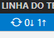

# Git

Vamos inicializar o git dentro desta pasta:

```sh
$ git init
```

Como esta pasta já existe, não vamos clonar o repositório, mas vamos adicionar o remoto do repositório. Vamos para GitHub...

1. Clique em "+" da barra de navegacao a direita do site de GitHub;
2. Clique em "New Repository"
3. No "Repository Name", escreva o nome do repositorio, por exemplo, `formulario-de-cadastro-pessoal`
4. Na "Description", descreva o projeto;
5. Selecione apenas "README". O ficheiro `.gitignore` deve ser seleciona apenas se for um projeto feito em React ou Vue ou em qualquer linguagem back-end;
6. Clique em "Create Repository"

Agora, como esta pasta ja existe antes do repositorio, vamos executar o comando:

```sh
git remote add origin https://github.com/CaiqueAraujo27/formulario-de-cadastro-pessoal.git
```

Realizamos o `pull` para pegar o `README`:

```sh
git pull origin main
```

Como Git Bash no Windows cria a branch `master` por padrnao, temos de trocar pela branch `main` porque a branch padrao no site de GitHub e `main`. 

```sh
git checkout -b main
```

Vamos adicionar os novos ficheiros:

```sh
git add .
```

O ponto `.` significa adicionar tudo. 

Vamos fazer um commit para descrever as mudancas e concluir a acao:

```sh
git commit -am "A inicializar o commit"
```

Vamos subir para o repositorio. Como e remoto, vamos ter de realizar com o sufixo de `-u origin main`:

```sh
git push -u origin main
```

Pronto. Mas quando fazemos novos ficheiros, vamos encurtar porque ja fez upstream remoto para o repositorio:

```sh
git add .
git commit -am "Descricao das mudancas"
git push
```

# Netlify

E simples e rapido. vamos diretamente para o site https://netlify.app/. 

1. clique em "New site from Git"
2. Selecione "GitHub"
3. Em "Pick repository", escolhe um dos repositorios
4. Na etapa final, deixe tudo da mesma forma sem tocar ou mudar, porque seu projeto ja e basico demais
5. Clique em "Deploy site"
6. Espere Netlify terminar de atualizar.

Cada mudanca feita no repositorio, Netlify atualiza-se. Nao precisa fazer nada. So espere um pouco. 

## Observacoes

O nome do ficheiro deve ser nomeado `ìndex.html`, que Netlify entenderá. 

## Dicas

O VSCode ja tem git integrado. Clica no icone assim:


Descreva as mudancas na mensagem, e clique no icone de:


E clique em:



Pronto. Netlify atualiza-se. 
